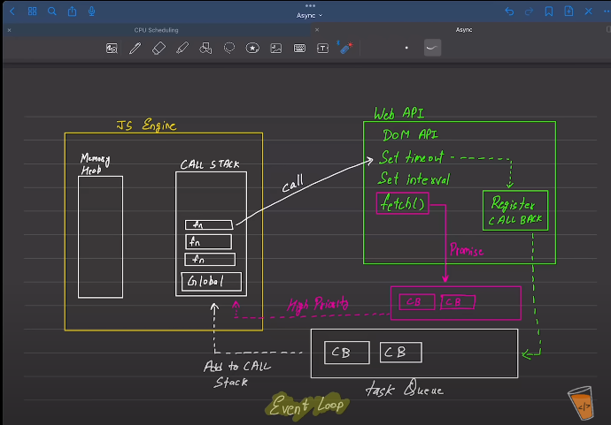

## Types of codes in JS

### There are two types of code in JavaScript
1. Blocking Code:
                It blocks the flow of the program
                Read File Snychronus
2. Non-Blocking Code:
                    It does not block the execution
                    Read File Asynchronus

## Event Loop

Whenever we write async code, there should be a mechanism that may be remind to execute a async code later for the purpose.
Such mechanisms are Web APIs/ Node APIs

For example:
    Suppose a function calls setTimeout(), the call is transferred from JS engine(Call Stack) to Web API (which has access to setTimeout()).
    The setTimeout() is set to 2 seconds timeout of the function. 

    The callback for setTimeout() is sent to Register Callback, where it registers the given timeout that may be set on an event

    Then there is task queue(LIFO), which collects the callbacks from the Register and adds them back to the Call Stack(FIFO) and instantly the call runs

## fetch() API

It works on task queue as well but for task queue has been expanded or streched to High Priority Queue
fetch() is used for promises, which generally delays a task 

